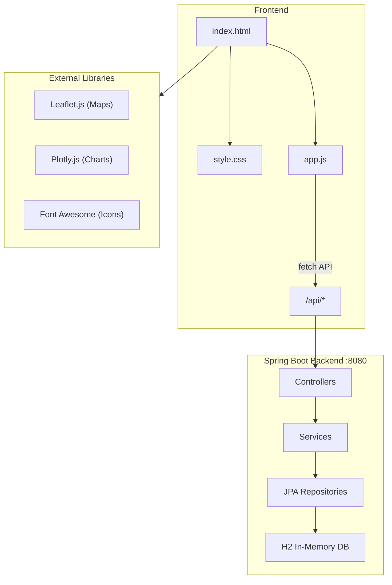

# Propridict – Premium Land Price Predictor

Propridict is an AI-driven, interactive web application designed to predict and analyze land prices across **25+ major Indian cities**. By combining historical data with modern urban premium factors, interactive maps, stamp duty calculators, and live bank offers, Propridict provides a comprehensive, end-to-end property investment planning dashboard.

---

## 🌟 Key Features

### 1. 📈 CAGR-Driven Price Projections
* Uses historical data (2018–2024) to compute the **Compound Annual Growth Rate (CAGR)** for specific localities.
* Projects land values dynamically for any future year up to **2050**.

### 2. 💎 Premium Factor Pricing adjustments
Adjusts the property valuation in real-time based on premium physical features:
* **Road Width**: +0.10% price premium per foot above standard 30 ft.
* **Frontage**: +0.05% price premium per foot above standard 40 ft.
* **Corner Plot**: +10.00% flat valuation boost.

### 3. 🗺️ Interactive Leaflet Map
* Map automatically centers and drops pins on the selected landmark/area.
* Displays coordinates and region bounding boxes.

### 4. 🏦 Live Bank Loan Offers & EMI Calculator
* Computes monthly EMIs, interest accrued, and total payment amounts.
* Fetches filtered home loan & LAP (Loan Against Property) offers from major Indian banks (SBI, HDFC, ICICI, LIC, etc.).
* Allows sorting by **EMI**, **Interest Rate**, or **Processing Fee**.

### 5. 📑 Stamp Duty & Registration Estimator
* Support for **25+ Indian States/UTs**.
* Correctly factors in ownership type discounts (Male, Female, Joint).

### 6. 📊 Real-Time Summary Dashboard
* A premium glassmorphic KPI panel displaying aggregated pricing, Govt fees, loan principal, EMI, and the best available bank offer at a glance.

### 7. 🤝 consultation & Booking
* Integrated booking form that records consultation requests in the H2 Database and fails over gracefully to pre-filled `mailto:` links.

---

## 🏗️ Architecture



---

## 🚀 Getting Started

### Prerequisites
* **Java 17** or higher
* **Maven 3.8+**
* A modern web browser

---

### 1. Run the Backend Server
Navigate to the backend directory and run using Maven:
```bash
cd backend
mvn spring-boot:run
```
The Spring Boot server will start on **`http://localhost:8080`**.

#### 🗄️ Database Console
The application uses an in-memory H2 database seeded with comprehensive mock data (300+ city rates, 25 state duty rules, and 28 bank products).
* **Console URL**: `http://localhost:8080/h2-console`
* **JDBC URL**: `jdbc:h2:mem:propridictdb`
* **User Name**: `sa`
* **Password**: *(leave blank)*

---

### 2. Run the Frontend App
You can open `index.html` directly in your browser, or serve it using any static HTTP server. For example:
```bash
npx http-server -p 3000 --cors -c-1
```
Then navigate to **`http://localhost:3000`**.

---

### 3. Run Automated Integration Tests
Run the comprehensive suite of 26 integration tests:
```bash
cd backend
mvn test
```

---

## 🛠️ Technology Stack
* **Frontend**: Vanilla HTML5, Vanilla CSS3 (Custom Glassmorphic Layouts, Responsive Grids, Variables), Modern Vanilla JavaScript (ES6+), Leaflet.js, Plotly.js.
* **Backend**: Spring Boot 3.2, Spring Data JPA, H2 Database (In-Memory), Lombok, Jakarta Validation.

---

## 📝 License
This project is licensed under the MIT License.
